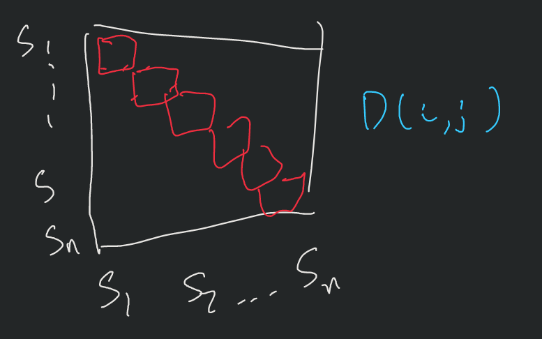

# Persistent Homology Summaries

## Problem Statement
Download some protein structures from protein data bank . Compute suitable persistence diagrams (as topological summaries) for these atomic structures. Compare / cluster them via some clustering method. You can try different distance metrics for persistence diagram summaries.

Alternatively, you can focus on a few molecules and provide detailed topological analysis. I think they have structures for some SARS-CoV-2 Spike and Antibodies available http://pdb101.rcsb.org/motm/256. You can study their topological profiles.

## Questions

1. **What is the optimal persistent homology summary that I should perform**
    - Generate Cycles from diagrams
       1.  Pont Cloud representation
       2.  Graph representation

2. **Just Elevation Functions, or are there other models I should also look at**
   1. No library already exists for easy implementation, so skip this

3. What ways to compare persistence diagrams?
   1. Baseline:
      1. Generate persistance profile
            
      2. Generate heat map of hierarachical clustering
         <!-- 1.  -->
         

      